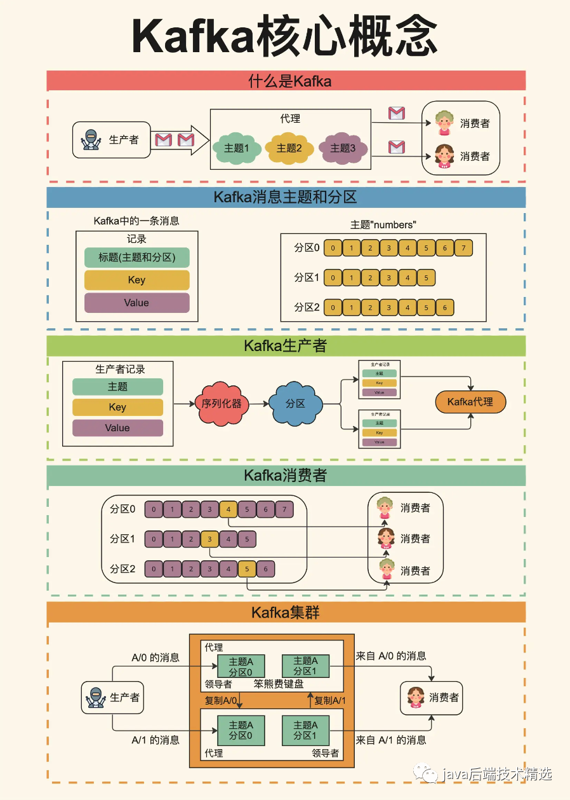

# 2. 核心概念与底层

非常好 👍  
这是学习 **Kafka 核心机制** 的关键阶段。  
这一章的目标是让你——不只是“能跑通Kafka”，而是​**从原理层面理解为什么Kafka这么设计、它是怎么保证性能与可靠性的**。

---

## 🧩 整体学习地图

|模块|关键词|掌握目标|
| ------| --------------------------------| -------------------------------------------------|
|**Topic / Partition**|并行性、顺序性、吞吐|知道为什么 Kafka 是“分区日志”，如何决定分区数|
|**Replica / ISR / Leader**|高可用、容错、数据一致性|理解 Kafka 的复制机制和选举流程|
|**Offset / Consumer Group**|消费进度、重平衡、提交策略|掌握 offset 的生命周期与消费语义|
|**Retention / Compaction**|日志保留、磁盘优化|理解 Kafka 的“日志型存储”|
|**SerDe / Schema Registry**|数据格式演进|学会在企业级中安全升级 schema|
|**Delivery Semantics**|至少一次 / 最多一次 / 精确一次|理解 Kafka 在不同配置下如何保证语义|
|**实践**|producer + 2 个 consumer|手动触发 rebalance、测试 offset 提交差异|

---

## ① Topic 与 Partition

### 🧠 概念

Kafka 的核心单位是 ​**Topic（主题）** ​，相当于一个消息分类或数据流通道。  
每个 Topic 被划分为多个 ​**Partition（分区）** ​，每个分区是一个**有序、不可变**的消息日志（append-only log）。

一个分区内：

- 每条消息都有唯一的偏移量（`offset`）
- 顺序是严格保证的（FIFO）

但不同分区之间：

- 没有全局顺序（可能乱序）
- 可并行读写 → 提高吞吐

### 💡 为什么要分区？

- ​**提高并行度**：每个分区可以由不同的 broker 管理，Producer/Consumer 可并行操作。
- ​**水平扩展**：增加分区数就能提升吞吐。
- ​**容错性**：分区副本分布在不同 broker，提高可用性。

### ⚖️ 分区数量的影响

|维度|增加分区的影响|
| ----------| -------------------------------------|
|吞吐|✅ 提升：更多 broker 并行写入|
|并行消费|✅ 提升：更多 consumer 可并行|
|顺序性|❌ 降低：消息只能保证分区内有序|
|管理成本|❌ 增加：更多元数据、rebalance 更慢|

> **经验规则**：分区数 ≈ 预期消费者并行度 × 2  
> 例如预计有 4 个 consumer，则可以设 8 个 partition。

#### 图片


​​

---

## ② Replica、ISR、Leader Election

### 🧠 概念

每个 Partition 都会在多个 Broker 上保留副本：

- **Broker :**  代理节点  （每个Broker就是一个服务器进程，多个broker组成kafka集群）
- **Replica** 副本：每个分区可以设置多个副本，用于容错与高可用   =》 leader 、follower
- **Leader 副本**：负责读写请求。
- ​**Follower 副本**：被动复制 leader 数据。
- ​**ISR（In-Sync Replica）集合**：与 leader 同步的副本集合。

### ⚙️ 写入流程

假设 producer 向 topic 的一个分区写入数据：

1. Producer 连接该分区的 ​**Leader broker**；
2. Leader 写入本地日志；
3. Follower 向 Leader 拉取最新数据；
4. 当 follower 同步完成后，它们被视为“in-sync”（即在 ISR 内）

### ISR （In-Sync Replicas, 同步副本集)

ISR 是 Leader 与其同步的 follower 副本集合

- 只有 **在 ISR 内的副本** 才有资格被选为新的 Leader
- ISR 保证：即使 leader 宕机，仍可从 ISR 成员中选出一个“数据一致”的leader

### ⚡ 故障选举

当 leader 所在的 broker 宕机：

- Controller（Kafka 内部元数据管理者）会在 ISR 中选一个新的 leader。
- 若 ISR 全挂掉 → 可能数据丢失或分区不可用。

### ⚖️ 一致性与可用性权衡

- ​`acks=1` → 高性能但可能丢数据。
- ​`acks=all` + ISR 完整 → 高可靠但稍慢。
- ​`unclean.leader.election.enable=false` → 保证一致性（不选滞后的副本）。

---

## ③ Offsets & Consumer Group

### 🧠 概念

Consumer Group 是 Kafka 的消费核心单位。

- 同一 Group 内的消费者 ​**共享一个订阅关系**。
- 每个 Partition 只会被 **组内一个消费者** 消费。
- 不同 Group 可以独立消费相同数据。

### ⚙️ offset 提交机制

Kafka 不主动记录消费者进度，必须​**提交 offset**：

|模式|说明|
| ------| ---------------------------------------------------------|
|**Auto Commit**|定期自动提交（默认5秒）➡️ 简单但可能重复/丢失|
|**Manual Commit**|程序逻辑控制提交时机➡️ 精确控制“消息处理成功才提交”|

### ⚡ Rebalance（重平衡）

当 group 成员变化（新增/挂掉）时：

1. coordinator 触发 rebalance。
2. 所有 consumer 暂停消费。
3. 重新分配分区 → 各消费者获得新任务。
4. 重启消费 → 若 offset 未提交，可能重复消费。

---

## ④ Retention 与 Compaction

### 🧠 Retention（保留策略）

Kafka 是 **日志系统** 而非队列，消息不会被“消费掉”，只会​**定期清理**。

配置方式：

```properties
log.retention.hours=168  # 7天
log.retention.bytes=1GB  # 按大小清理
```

应用：

- ​**日志采集**：保留原始事件日志。
- ​**流处理**：短期缓存消息。

---

### 🧠 Compaction（压缩策略）

如果 topic 设置为 `cleanup.policy=compact`：

- Kafka 只保留每个 key 的最新消息。
- 适合 key-value 状态同步场景。

例：用户余额、配置状态、物联网设备状态。

---

## ⑤ 序列化 / 反序列化（SerDe）与 Schema Registry

### 🧠 概念

Producer 在发送前需要序列化对象 → 字节流；  
Consumer 收到消息后需要反序列化。

常见格式：

|格式|特点|
| ----------| -----------------------------------|
|JSON|可读性强，性能一般，schema 演进难|
|Avro|二进制紧凑，支持 schema 版本管理|
|Protobuf|高性能、强类型，跨语言支持好|

### 🧠 Schema Registry

Confluent 的 Schema Registry 用于：

- 存储每个 topic 的 schema（版本控制）
- 验证兼容性（防止 producer/consumer 不兼容）
- 生产环境必备（尤其是微服务多语言时）

---

## ⑥ Delivery Semantics（消息交付语义）

|模式|定义|Kafka 支持方式|
| ------| --------------------------------| -------------------------|
|**At-most-once**|消息最多被处理一次（可能丢失）|提前提交 offset|
|**At-least-once**|消息至少被处理一次（可能重复）|处理后再提交 offset|
|**Exactly-once**|消息只处理一次（不丢不重）|幂等生产者 + 事务性消费|

### 🧠 Idempotent Producer

Kafka 提供 `enable.idempotence=true`：

- 每条消息带唯一序列号。
- Leader 发现重复则丢弃 → 避免重复写入。

### 🧠 事务（Transactions）

Producer 开启事务：

```java
producer.initTransactions();
producer.beginTransaction();
// 发送消息
producer.send(...);
// 提交事务
producer.commitTransaction();
```

与 consumer 协同使用可实现 ​**exactly-once**（需要 Kafka Streams 或支持事务的 consumer）。

---

## ⑦ 实操：Producer + 两个 Consumer

### 🧱 环境准备

使用 Docker Compose（单节点 Kafka + UI）：

```yaml
version: '3'
services:
  kafka:
    image: bitnami/kafka:3.8
    environment:
      - KAFKA_CFG_NODE_ID=1
      - KAFKA_CFG_PROCESS_ROLES=broker,controller
      - KAFKA_CFG_LISTENERS=PLAINTEXT://:9092,CONTROLLER://:9093
      - KAFKA_CFG_ADVERTISED_LISTENERS=PLAINTEXT://localhost:9092
      - KAFKA_CFG_CONTROLLER_QUORUM_VOTERS=1@localhost:9093
      - KAFKA_CFG_AUTO_CREATE_TOPICS_ENABLE=true
    ports:
      - "9092:9092"
```

---

### 🧩 Java Producer 示例（Spring Kafka）

```java
@SpringBootApplication
public class ProducerApp {
    public static void main(String[] args) {
        SpringApplication.run(ProducerApp.class, args);
    }

    @Bean
    public CommandLineRunner send(KafkaTemplate<String, String> template) {
        return args -> {
            for (int i = 0; i < 5; i++) {
                template.send("demo-topic", "key" + i, "message-" + i);
            }
        };
    }
}
```

---

### 🧩 Consumer 示例（不同 Group）

```java
@KafkaListener(topics = "demo-topic", groupId = "group-A")
public void consumeA(String msg) {
    System.out.println("A received: " + msg);
}

@KafkaListener(topics = "demo-topic", groupId = "group-B")
public void consumeB(String msg) {
    System.out.println("B received: " + msg);
}
```

运行时你会看到：

- 两个 group 各自消费所有消息（互不干扰）
- 在同一 group 内，分区会被自动均分

你可以手动暂停一个 consumer，看另一个是否 rebalance 重新接手分区。

---
